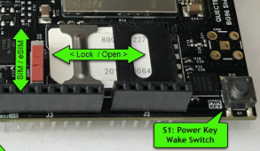
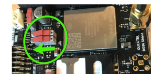
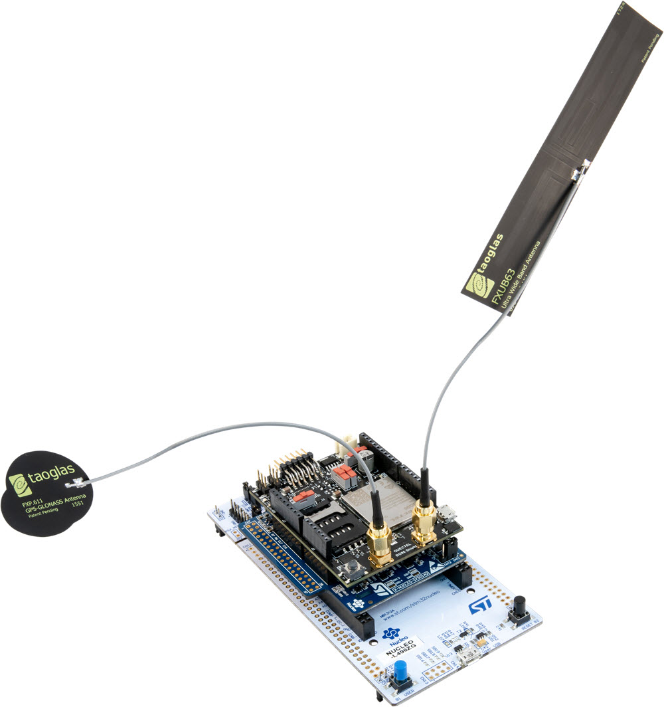
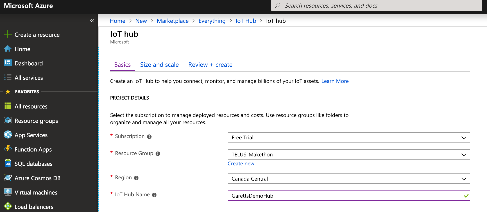
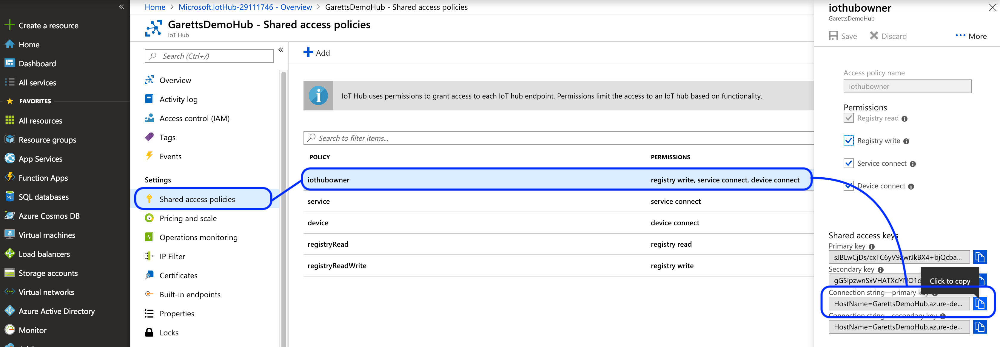
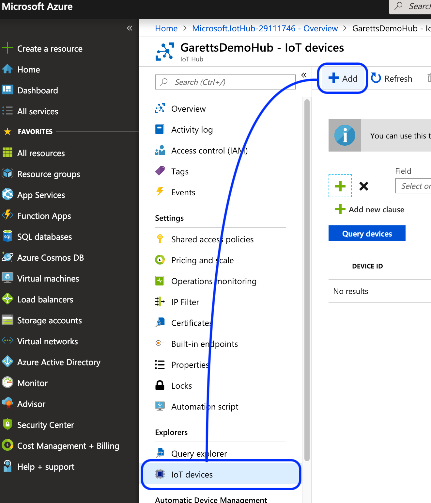
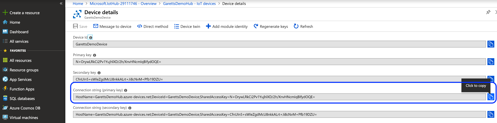
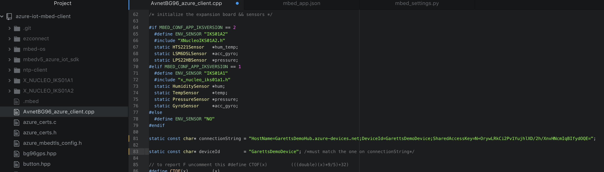
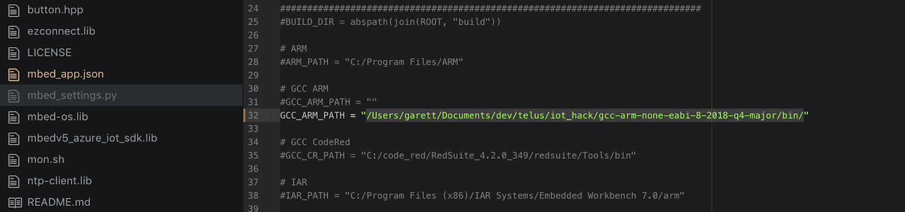
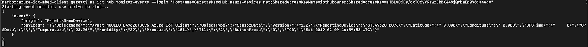

# The TELUS LTE-M IoT Starter Kit

This tutorial will help get you started with the TELUS LTE-M IoT Starter Kit, giving you some background on the kit and walking you through the entire process of getting the Kit configured to send data to your own Microsoft Azure instance.

## Let’s start with some background

### The Kit

The Kit Consists of 3 Parts:
1. BG96 shield Cat.M1/NB1 & EGPRS module with added support for GPS
A 2FF SIM connector accommodates the TELUS Starter SIM that is included in the kit for connecting to the internet via TELUS’ virtual dedicated IoT network
2. X-NUCLEO-IKS01A2 sensor board for the STM32
It is equipped with Arduino UNO R3 connector layout and is designed around the LSM6DSL 3D accelerometer and 3D gyroscope, the LSM303AGR 3D accelerometer and 3D magnetometer, the HTS221 humidity and temperature sensor and the LPS22HB pressure sensor
3. NUCLEO L496ZG-P MCU
The NUCLEO-L496ZG microcontroller board is fitted with an STM32L496ZG microcontroller, clocked at 80 MHz, with 1MB Flash memory, 320 KB RAM (for development flexibility), up to 115 GPIOs, an on-board ST-LINK/V2-1 debugger/programmer, and multiple expansion interfaces (USB OTG host interface, ArduinoTM Uno V3 compatible expansion headers and ST Morpho headers), and is supported by comprehensive STM32 free software libraries and examples.


### MBed OS
ARM Mbed OS is a free, open-source embedded operating system designed specifically for the "things" in the Internet of Things.

It includes all the features you need to develop a connected product based on an ARM Cortex-M microcontroller, including security, connectivity, an RTOS, and drivers for sensors and I/O devices.

### Configuring Your IoT Hardware

The BG96 and X-NUCLEO-IKS01A2 are already connected to each other in the box.  Ensure that the switch is in the eSIM position. Some important parts of the board are below:



*[Image used from element14 Blog](https://www.element14.com/community/groups/mbed/blog/2018/09/21/implementing-an-azure-iot-client-using-the-mbed-os-part-2)*

Also, please ensure that the Rx/Tx slide switches are set as shown (maroon switches away from the BG96 chip:



*[Image used from element14 Blog](https://www.element14.com/community/groups/mbed/blog/2018/09/21/implementing-an-azure-iot-client-using-the-mbed-os-part-2)*

Connect the BG96 with sensor module to the L496 MCU so it looks like below:


*[Image used from element14 Blog](https://www.element14.com/community/groups/mbed/blog/2018/09/21/implementing-an-azure-iot-client-using-the-mbed-os-part-2)*


Now your hardware is ready to be connected and programmed.


## Getting Your Software and Services Configured

### Pre-Requisites (Download and Extract/Install)
There are several tools we’ll need to use throughout this tutorial, so let’s start by installing everything we can at this point:
1. [Git](https://git-scm.com/book/en/v2/Getting-Started-Installing-Git)
2. [Mercurial](https://www.mercurial-scm.org/downloads)
3. [Python 2.7](https://www.python.org/downloads/release/python-2713/) (already built into MacOS)
4. [GNU ARM Embedded Toolchain](https://developer.arm.com/open-source/gnu-toolchain/gnu-rm/downloads)
5. [Azure Command-Line Tools](https://docs.microsoft.com/en-us/cli/azure/install-azure-cli?view=azure-cli-latest)

#### Windows
Add Python to your user or systems PATH environment variable

### MBED Command Line (mbed-cli)
The mbed-cli is hosted on github and built in Python, so we can download it using `git` and compile using `Python`, now that we have made sure both are installed on our computer.

From the command-line:
1. `git clone https://github.com/ARMmbed/mbed-cli.git`
2. `cd mbed-cli`
3. `python setup.py install`

Now you should be able to run the `mbed` command from your command-line, you may need to relaunch your terminal for it to work. In Windows you may need to instead run `python -m mbed`.

### Download the Avnet Azure IoT Client
Avnet has created a client for the TELUS IoT starter kit that, with a couple of configuration tweaks, is ready to compile and load onto your IoT board.

Get the client downloaded by running the following from the command-line:
1. `mbed import https://github.com/Avnet/azure-iot-mbed-client`
Note: In Windows you may need to prepend that command with `python -m`

The import will take a while, and we can’t do too much more with the client until we get Azure up and running, so let’s jump over to Azure to get things rolling on that side.

## Configuring Azure

### Setting Up Your Azure Account

Microsoft’s Azure is incredibly useful cloud platform that has built-in support for IoT and allows for simple integration with several other services. If you don’t already have an Azure account you can sign up for a free trial which comes bundled with $250 of free credits:
https://azure.microsoft.com/en-ca/

### Creating Your IoT Hub

Once you have your account created you can proceed to create a new IoT Hub from your Azure dashboard using the “Create New Resource” function:


Give your IoT a unique name, place it in the Canada East region and make sure your Subscription is set to “Free Trial”. Your new IoT Hub should look similar to this:



Proceed to “Review and Create” then create your instance. This may take a couple of minutes.

Now our IoT Hub is created! This will be our central location for all our IoT devices to connect and send whatever data we have configured them to relay, and gives us a single point to read and action on that data. Azure has security built-in, all communications between our IoT devices to Azure will be secured and visibility to that data is also protected. As a next step we are going to retrieve keys that we can use to securely transport and monitor the data being sent between our IoT devices and our newly created Azure IoT Hub.

Open your newly created IoT Hub instance, then select “Shared Access Policies” from the left-hand pane which will bring up a list of pre-created policies, select the one labeled “iothubowner”. A new right-hand pane will appear with a list of “Shared access keys”. Copy the one labeled “Connection string - primary key” and store it someplace safe for later.



The primary key we just copied can be used from the Azure command-line to monitor all traffic being sent from our IoT devices to the Hub. We will come back to the key once we have the IoT device configured, for now there’s nothing being sent to the Hub, so monitoring would be a bit boring…

### Create Your IoT Device

The next step is to create an IoT Device instance within your IoT Hub, this will be mapped directly to the physical IoT Device you are using. Open your IoT Hub then, from the left-pane, select “IoT Devices”, then click the “Add” button to create your new device.



Give your new device a name that is relevant to your project, this will be how you will identify the source of the data sent to your Hub. Leave the other settings as-is (“Symmetric Keys” selected and “Auto-generate keys” checked). Click “Save”.

Now that your IoT device is created, click it to bring up its “Device Details” screen. From this screen copy the “Connection String - primary key” and store it with the primary key you copied earlier from the IoT Hub creation step.



This primary key will be loaded to your IoT device to secure the communications channel between it and your IoT Hub.

At this point we have everything we need to complete the configuration of your TELUS LTE-M IoT Starter Kit, so we’ll jump back there.

### Configure Your IoT Device for Azure

Getting back to the “Download the Avnet Azure IoT Client” step from earlier on in the tutorial, hopefully it has completed importing which should have created a folder for you named “azure-iot-mbed-client”, within this folder there are 3 different files we need to configure. Open the following files in your editor of choice, the screenshots from below are from [Atom](https://atom.io/):
1. AvnetBG96_azure_client.cpp
2. mbed_app.json
3. mbed_settings.py

#### AvnetBG96_azure_client.cpp

This file handles the sensor information gathering from the IoT board sensors, crafting the sensor data into a message payload and communicating that payload to Azure. In this tutorial we’ll leave the file logic pretty much as-is, but if you feel the need to modify the function of the board, I recommend looking back to this file at a later time.

The only thing we need to configure in this file is the name of the IoT device (`deviceId`, line 83) and setting the connection string (`connectionString`, line 81). Set the device ID to the name you used for the IoT device in Azure, and set the connection string to the “Connection String - primary key” we just copied a couple steps ago when creating the IoT device. One thing to note, the device ID is actually part of the connection string. Below is a screenshot of my configured file:



#### mbed_app.json

This file requires a relatively small change, all we are doing is changing the `DEFAULT_APN` from `m2m-east.telus.iot` to `pp.telus.com`:


#### mbed_settings.py

In this file we need to update the `GCC_ARM_PATH` value to the location where you extracted the “GNU ARM Embedded Toolchain”. In my case I changed the line from `/usr/local/gcc-arm-none-eabi-7-2018-q2-update/bin/` to `/Users/garett/Documents/dev/telus/iot_hack/gcc-arm-none-eabi-8-2018-q4-major/bin/`:



NOTE: Ensure you include the trailing slash, ‘/’ on a Mac, or compilation will not succeed!

### Compile Time!

If you’ve stuck with my rambling til now, I’m happy to say you’re now ready to compile the Azure client and get it loaded to your IoT device. The following steps will get your client compiled and loaded to your board:
1. Run the terminal or command-line on your Mac or Windows PC respectively
2. Change to the directory to “azure-iot-mbed-client”
3. Plug a USB cable from the L496 MCU (white board) using the micro-usb cable into your computer
4. Check to see if there is a USB drive detected called NODE_L496ZG.  This means your board is connected.
5. Run the command:
  * ```mbed compile -m NUCLEO_L496ZG -t GCC_ARM --profile toolchain_debug.json```
    * *You may need to prepend the command with `python -m` on Windows or use `sudo` on Mac*
6. If all goes well, you will see the mbed compiler start creating your new bin file.  When it is complete, the file can be found in ./BUILD/NUCLEO_L496ZG/GCC_ARM/azure-iot-mbed-client.bin
7. Drag the created binary over to the NODE_L496ZG drive, this will load the new client software and reboot your IoT board

Once your board reboots it will immediately attempt to connect to the network, read sensor data and send that data to your IoT Hub.

Here’s an example of the payload sent from my device:
```
{
    "event": {
        "origin": "GarettsDemoDevice",
        "payload": "{\"ObjectName\":\"Avnet NUCLEO-L496ZG+BG96 Azure IoT Client\",\"ObjectType\":\"SensorData\",\"Version\":\"1.2\",\"ReportingDevice\":\"STL496ZG-BG96\",\"Latitude\":\" 0.000\",\"Longitude\":\" 0.000\",\"GPSTime\":\"     0\",\"GPSDate\":\"\",\"Temperature\":\"23.90\",\"Humidity\":\"89\",\"Pressure\":\"1011\",\"Tilt\":\"2\",\"ButtonPress\":\"0\",\"TOD\":\"Sat 2019-02-09 16:59:52 UTC\"}"
    }
}
```

The actual data fed into your Azure function will be the JSON contents of the `payload` object.

### Monitoring Data

If all goes well, your hub will start receiving the data from your board without incident. If any issues arise, or you just want to have a better idea of what is being sent to your Hub, it would be helpful to be able to see what exactly your board is doing and the raw data being sent.

### See Your Board Status

With the IoT board connected to your computer you are able to analyze the board status using the COM port the board has connected to the computer using.

#### MacOS
1. From your terminal and issue the command ls /dev/tty.*  This will show all the serial ports you have.  Look for /dev/tty.usbmodemxxxxx (on my Mac it was 14203), which will be the board
2. Issue the command screen /dev/tty.usbmodemxxxxx 115200 (where xxxxx is for your particular Mac).  This connects to your device and displays the terminal output with baud rate of 115200.

#### Windows
1. Download and install the [Quectel LTE USB Driver](https://www.quectel.com/product/bg96.htm)
2. Using your client of choice (I prefer [Putty](https://www.putty.org/)) open a Serial connection to the COM port the board is using (you can determine this using Windows’ Device Manager), and a Baud Rate of 115200.

If you don’t see anything in the terminal after following the above steps, press the black “RESET B2” button on the white board, this will reboot the board and should present you with a screen similar to this one in the terminal:


Output will continue to produce as the board makes repeated network sends to Azure. You won’t, however, get to see the actual payload being send.

### Monitoring Payloads Sent to Azure

The Azure CLI tool will let us monitor the payloads sent from the board to Azure. The following commands will let you see the payloads sent in real-time:
1. Issue the following command to log in to Azure from the command-line
  * `az login`
  * A browser will open, log in using your Azure credentials
1. Retrieve the “Connection String - primary key” that you copied earlier when you created your IoT Hub, with it, issue the following command in the command-line terminal:
  * `az iot hub monitor-events --login "<your_connection_string"`


If all goes well you will start seeing JSON payloads as they are sent to the server:



## Done

By following the above tutorial your TELUS LTE-M IoT Starter Kit is now connected to your Azure instance and sending sensor data on a regular basis. Now you just need to do something amazing with that data!

I recommend making use of one of the fantastic tutorials for how to do something with your IoT data (e.g. store it in a database, trigger an action if the data meets some criteria). This one is great to get you started:
https://github.com/Azure-Samples/functions-js-iot-hub-processing

Just bear in mind that the data being sent from your IoT board is in a different format than expected by the tutorial, so you will need to add your own parsing logic. I have updated the Function code to work with the TELUS IoT board:
```
module.exports = function (context, IoTHubMessages) {
    context.log(`JavaScript eventhub trigger function called for message array: ${IoTHubMessages}`);

    var count = 0;
    var totalTemperature = 0.0;
    var totalHumidity = 0.0;
    var deviceId = "";
    var deviceId = "";

    IoTHubMessages.forEach(message => {
        count++;
        totalTemperature += parseFloat(message.Temperature);
        totalHumidity += parseFloat(message.Humidity);
        deviceId = message.ObjectName;
    });

    var output = {
        "deviceId": deviceId,
        "measurementsCount": count,
        "averageTemperature": totalTemperature/count,
        "averageHumidity": totalHumidity/count
    };

    context.log(`Output content: ${output}`);

    context.bindings.outputDocument = output;

    context.done();
};
```

Can’t wait to see what you come up with!


### Acknowledgements

Big thanks to [James Flynn](https://github.com/jflynn129) of Avnet for writing the original blog series and helper tools that this README is based off and uses. You can find the 2 related articles authored by James [here](https://www.element14.com/community/groups/mbed/blog/2018/09/21/implementing-an-azure-iot-client-using-the-mbed-os-part-1) and [here](https://www.element14.com/community/groups/mbed/blog/2018/09/21/implementing-an-azure-iot-client-using-the-mbed-os-part-2)
